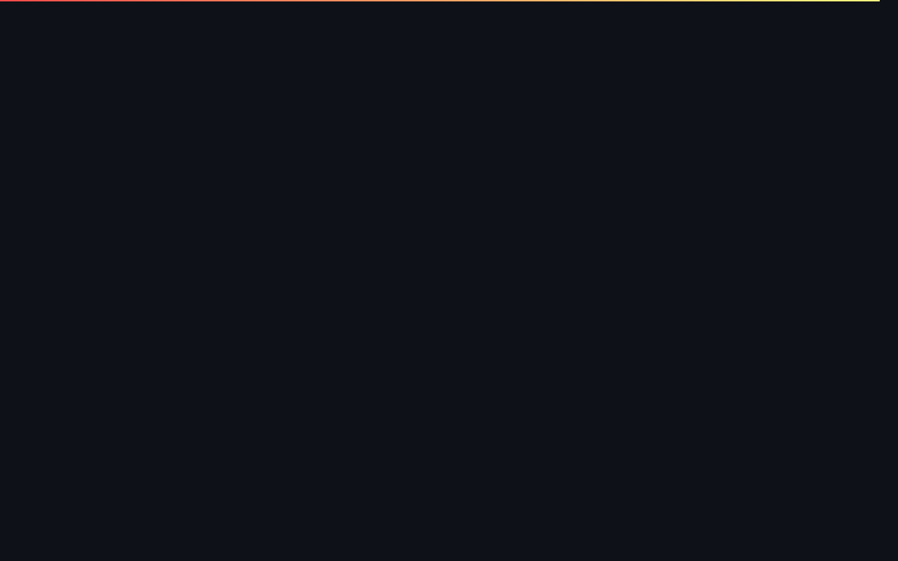

# SimuStruct AI: Multi-Hole FEM Stress Analysis



Welcome to **SimuStruct AI**, a comprehensive, interactive tool for analyzing Multi-Hole Stress using Finite Element Method (FEM) approximations. Built with Python, Streamlit, PyVista, and Gmsh, this application bridges the gap between complex mechanics simulations and accessible structural design.

## Features
- **Interactive UI:** Intuitive parameter controls allowing users to tweak plate length, height, thickness, and applied axial force securely.
- **Multiple Materials:** Preconfigured property databases for materials such as Steel, Aluminum, Titanium, Copper, Brass, Cast Iron, Polycarbonate, and Carbon Fiber.
- **Hole Configurations:** Adjust the number of holes, their positioning, and radii dynamically through the interface.
- **Automated Mechanics Calculation:** Calculates global max stress, max deformation, max strain, and Factor of Safety using advanced Kirsch stress approximations.
- **2D / 3D Plotting:** High-performance FEM stress gradient visualizations utilizing PyVista and Gmsh.
- **Stress Concentration Profiling:** Generates dynamic cross-sectional stress-decay profiles extending from the local hole boundaries using Matplotlib.
- **Report Generation:** Export beautifully formatted PDF analytical reports summarizing design properties and results on-the-fly (`fpdf`).
- **Dataset Generation:** Use mathematical randomization algorithms via the hidden headless simulation engine to generate massive simulation CSV datasets targeted for future ML integration/AI training!

## Quickstart
1. Ensure you have Python installed.
2. Install the required dependencies:
   ```bash
   pip install -r requirements.txt
   ```
3. Run the streamlit application:
   ```bash
   streamlit run app.py
   ```

## Deployment
This application is fully compatible with Streamlit Community Cloud (SC), Render, and other hosting platforms. Because `pv.start_xvfb()` is conditionally wrapped, the app securely spins up a headless rendering environment on Unix deployments without crashing local Windows test runs!
